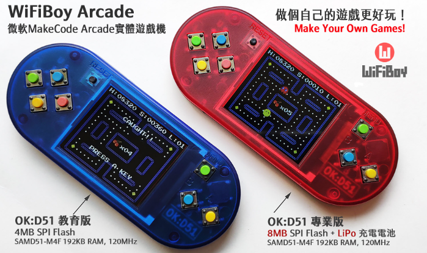
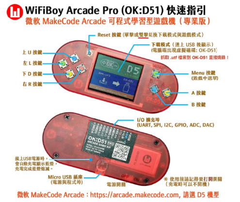

# 02.WiFiBoy Arcade D51 硬體簡介

## 前言

你是否曾經夢想過製作一個自己專屬的遊戲機平台?中年大叔的我，擁有過一台任天堂公司出的 GameBoy，當年遊戲主機價格貴、遊戲雖然可用卡匣的方式更換，雖然遊戲有趣，又能與同學連線對戰。但小學生彼此的天馬行空想法，總想實現在遊戲中。等到大了點，開始接觸到資訊相關課程，才知道實作硬體電路、編寫程式與製作並出版遊戲是多麼不容易的一件事。

由於近幾年 Maker 自造者風氣盛行，加上嵌入式系統硬體成本降低，許多社群提供了不少方便好用的工具。讓自製遊戲機的夢想，不再是遙不可及。我們這次使用了一位台灣年輕的創業家開發的遊戲硬體，來學習 MakeCode Arcade 的遊戲製作。與其整天玩人家寫好的手機遊戲，不如開發自己的小遊戲，一方面也可以重溫兒時回憶外，也能作為在學校推廣程式教育的好工具。

## 設備需求清單

1. 您需要一台可聯網桌機或是筆記型電腦，Windows、MacOS、Linux 系統均可。
2. 一台 WiFiBoy Arcade Pro 2024 版

## 硬體介面介紹

打開 WiFiBoy Arcade D51 的包裝，您會看到一份硬體簡介資料:

* CPU 型號: Microchip SAMD51
* CPU 執行速度: 120Mhz
* 記憶體: 192 KB 
* 儲存空間: 512KB Flash + 8MB SPI-Flash
* 螢幕: 1.8吋 TFT 液晶顯示器(160x128 點，16 bit顏色，ST7735S 驅動)
* 擴充介面: 12 pins 2.54 mm I/O 擴充埠(帶有 JACDAC 通訊埠與 SWD Serial Wire Debug埠)
* 按鍵: 訂製遊戲級彩色按鍵
* 外殼: 半透明彩色高質感塑膠硬殼。
* 電池: 3.7V 180 mah，可連續使用 3 ~ 5小時的鋰電池，充電約兩小時

WiFiBoy Arcade 的 CPU 效能較佳，遊戲程式運行較為流暢。隨機存取記憶體比競爭產品大了一倍，執行許多複雜遊戲範例不當機。較大的 SPI-Flash 空間，可以安裝更多的程式與擴充模組。

其實微軟的 MakeCode 官方網站也有提供自行設計遊戲主機的參考資料，您可以點選 [客製化硬體](https://arcade.makecode.com/hardware/adding)連結來查詢相關資訊，內容主要有:

* [最精簡的 PXT-Arcade 開源硬體設計](https://github.com/microsoft/pxt-arcade-hardware-designs)
* [D51 UF2 引導載入程式(Bootloader)](https://github.com/microsoft/uf2-samdx1)

## 程式碼

本單元沒有相關的程式

## 參考資料

1. [GameBoy](https://zh.wikipedia.org/zh-tw/Game_Boy)
2. [WiFiBoy Arcade D51 玩學機官網](https://wifiboy.org/)