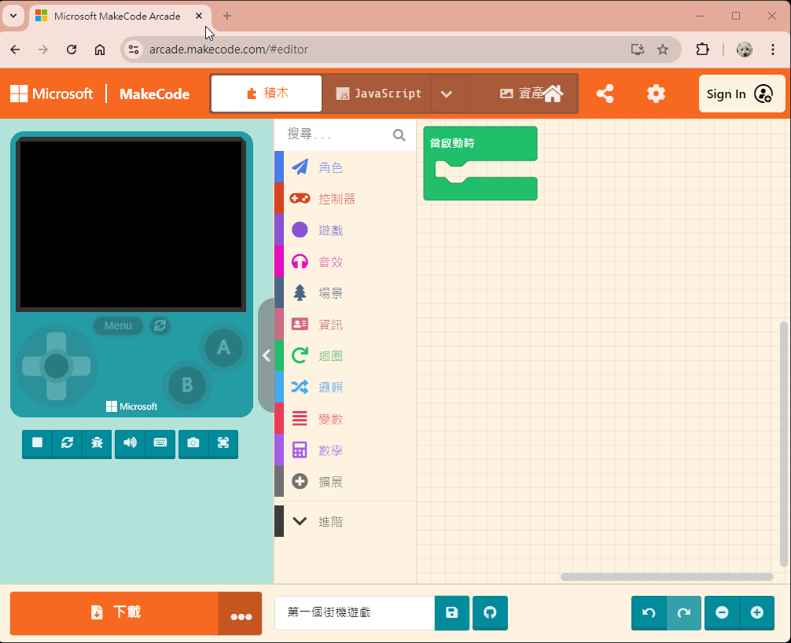
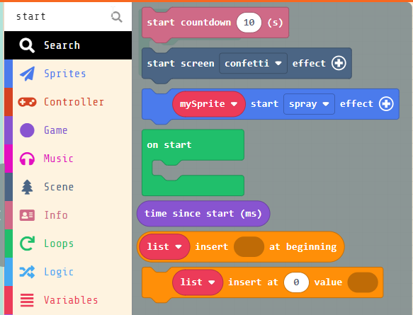
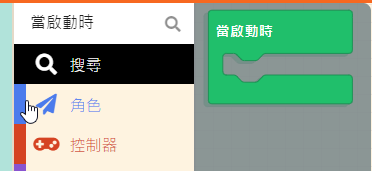
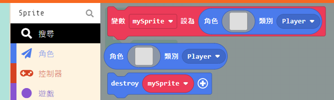
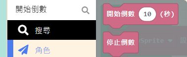
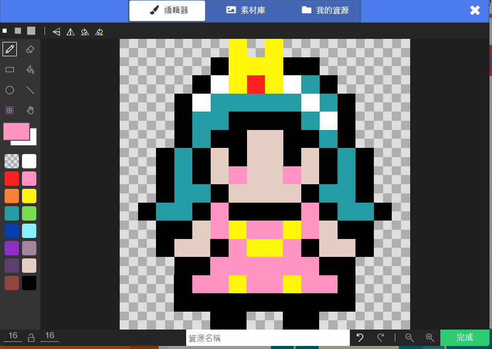
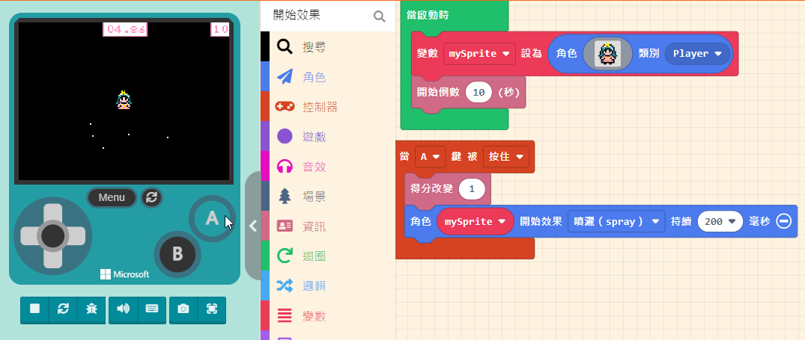
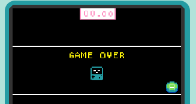
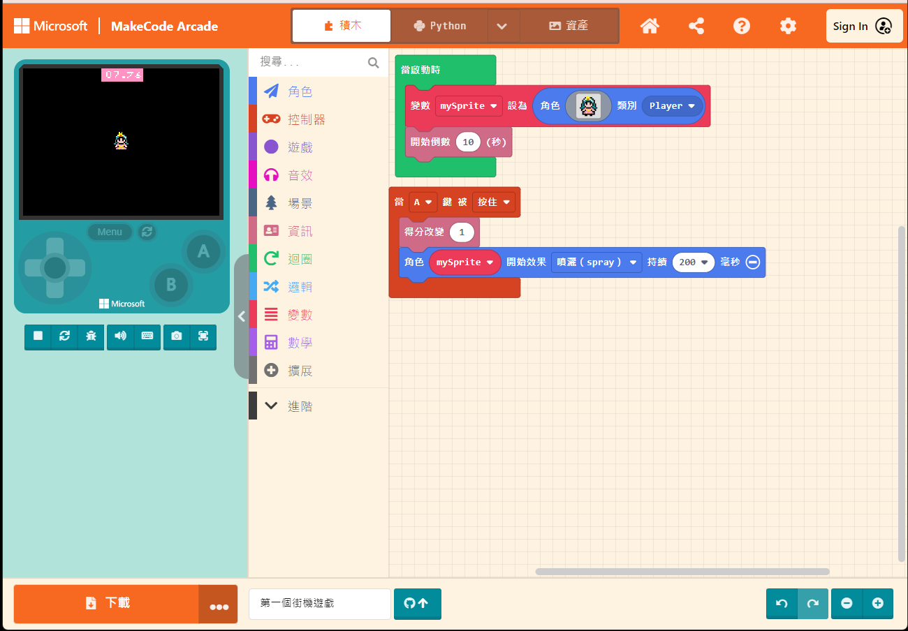
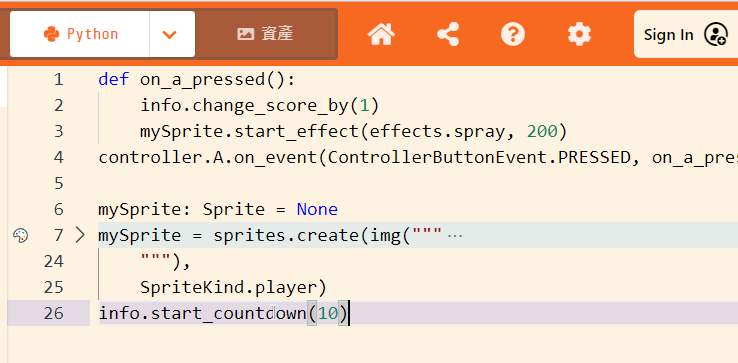

# 03.十分鐘建立你第一個街機遊戲

## 前言

如果告訴你，十分鐘內就能建立你第一個街機遊戲，相信大部份的爸媽都不會相信。在過去的90年代，要寫一個紅白機遊戲，要學的東西可不少。除了組合語言外，程式設計師還需要身兼美術設計、音樂製作與劇本開發等職位。

不過現在有微軟提供的 MakeCode Arcade 遊戲開發平台，您可以先暫時忘記複雜的程式語言、艱澀的硬體電路設計，專心先從基礎的積木環境進行遊戲設計體驗，了解此平台提供的主要開發工具，並查詢相關教學範例，開發第一個桌機遊戲。


## 設備需求清單

1. 您需要一台可聯網桌機或是筆記型電腦，Windows、MacOS、Linux 系統均可。
2. 一台 WiFiBoy Arcade Pro 2024 版

## 內文

本篇文章，我們試著用十分鐘，六個基本積木來教您製作第一個街機遊戲。

1. 請開啟 [https://arcade.makecode.com](https://arcade.makecode.com) 網站，點選橘色圖案「新增專案」(New Project)，建立一個專案。


請幫我們的遊戲專案名稱取個名字，例如「第一個街機遊戲」。然後點選「創建(Create)」按鈕。


2. 開啟專案後，您在視窗左側可以看到一個類似 GameBoy 主機的模擬器畫面，中間的部份有許多功能的工具箱(您可以在此處找到所有用來建立遊戲的積木工具)。右側的視窗則是編寫程式的區域(您可以自由地組合積木來完成遊戲)
。



3. 利用中間的搜尋功能，下關鍵字來找出所有要用的積木。
	- 當啟動時(On Start)。(此積木是在迴圈(Loops)類別中)  
	- 使用 **Sprite** 找到設定角色類別的積木。(此積木是在角色(Sprites)類別中) 
	- 使用 **開始倒數** 找到開始倒數的積木。(此積木是在資訊(Info)類別中) 
	- 點選角色圖案，開啟圖案編輯器(Sprites Editor)，點選素材庫，選擇公主圖案，然後點選完成。 
	- 使用 **當** 找到當 A 按鍵被按住的積木。(此積木是在控制器(Controller)類別中) 
	- 使用 **改變** 找到「得分改變」積木。(此積木是在資訊(Info)類別中) 
	- 使用 **開始效果** 找到「開始效果」積木。(此積木是在角色(Sprites) / 效果(Effects)類別中)
4. 組合所有積木元件，完成如下圖的結果，然後執行左邊視窗的遊戲模擬器。 

5. 請你觀察幾個現象:
	- 遊戲會持續多少時間? 
	- 如果按下 A 鍵會出現什麼效果?
	- 分數是由哪個按鍵控制?10秒內妳最高可以得幾分?
	- 遊戲結束後會出現什麼畫面?



## 程式碼

積木程式碼

點選積木旁邊的 Python 按鈕，MakeCode Arcade 平台會幫您轉換成 Python 程式碼。 







```
def on_a_pressed():
    info.change_score_by(1)
    mySprite.start_effect(effects.spray, 200)
controller.A.on_event(ControllerButtonEvent.PRESSED, on_a_pressed)

mySprite: Sprite = None
mySprite = sprites.create(img("""
        . . . . . . 5 . 5 . . . . . . . 
            . . . . . f 5 5 5 f f . . . . . 
            . . . . f 1 5 2 5 1 6 f . . . . 
            . . . f 1 6 6 6 6 6 1 6 f . . . 
            . . . f 6 6 f f f f 6 1 f . . . 
            . . . f 6 f f d d f f 6 f . . . 
            . . f 6 f d f d d f d f 6 f . . 
            . . f 6 f d 3 d d 3 d f 6 f . . 
            . . f 6 6 f d d d d f 6 6 f . . 
            . f 6 6 f 3 f f f f 3 f 6 6 f . 
            . . f f d 3 5 3 3 5 3 d f f . . 
            . . f d d f 3 5 5 3 f d d f . . 
            . . . f f 3 3 3 3 3 3 f f . . . 
            . . . f 3 3 5 3 3 5 3 3 f . . . 
            . . . f f f f f f f f f f . . . 
            . . . . . f f . . f f . . . . .
    """),
    SpriteKind.player)
info.start_countdown(10)
```

## 參考資料

* [積木式程式語言簡介](https://arcade.makecode.com/blocks)
  * [當啟動時（On Start）](https://arcade.makecode.com/blocks/on-start)
  * [資訊(Info) 類別](https://arcade.makecode.com/reference/info)
  * [角色(Sprites) 類別](https://arcade.makecode.com/reference/sprites)
* [積木程式參考文件 https://arcade.makecode.com/reference](https://arcade.makecode.com/reference)

