# 04.建立專案、保存與匯入專案

## 前言

學會了製作第一個街機程式，如果沒有存檔，關閉瀏覽器視窗，您辛苦編寫的程式就會消失。本日我來教大家如何保存專案與匯入之前建立的遊戲專案。

養成時時存檔的好習慣，會讓您的遊戲製作過程更有效率。如果您有使用過 [Github](https://github.com/) 這個版本控管的服務，也可以嘗試將您的街機遊戲程式碼分享到 Github 網站上，與其他的朋友一起開發這個遊戲。

## 設備需求清單

1. 您需要一台可聯網桌機或是筆記型電腦，Windows、MacOS、Linux 系統均可。
2. (可選擇) 申請一個 Github 帳號。

## 儲存專案、下載掌機專用的執行檔與搭配 Github 進行遊戲開發

* 儲存 
  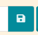 
  開發視窗底下中間的部份，會有一個像**磁片**的保存按鈕圖示，點選它之前，您可以修改遊戲專案的名稱。點選它，您可以將專案打包成一個 png 檔，未來您可以直接將 PNG 檔拖入或是匯入到 MakeCode Arcade 的開發環境中，還原當初的開發狀態。

* 下載 
   
  下載按鍵最初的設計是讓您將程式的執行檔存到掌上型的遊戲機，因為每一種硬體使用的 MCU 微處理器並不相同，這些執行檔無法跨機種執行。像我們的 WiFiBoy Arcade D51 Pro 是使用 D5 系列的 MCU，因此您要選擇 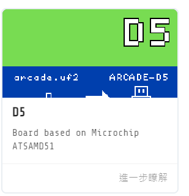 這個機型，然後產出相對的 「arcade-第一個街機遊戲.uf2」。
  
  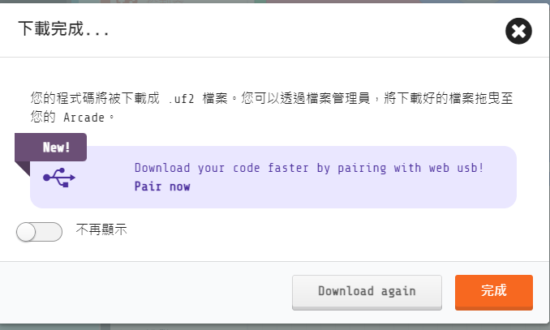

* 保存到 Github  
  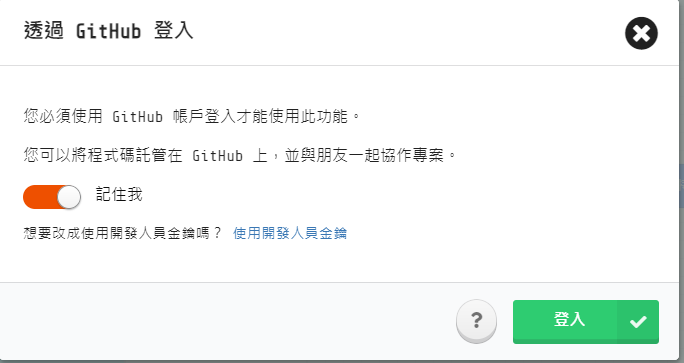 
  開發環境中下方有個很像貓咪圖案的按鈕，這是保存到 Github 的功能。請參閱 [申請Github 帳號的文章](https://git-scm.com/book/zh-tw/v2/GitHub-%E5%BB%BA%E7%AB%8B%E5%B8%B3%E6%88%B6%E5%8F%8A%E8%A8%AD%E5%AE%9A)，申請一個 Github 帳號。使用 Github 帳號登入會需要驗證帳號密碼，也會需要您輸入驗證碼。

  使用 Github 帳號登入

 	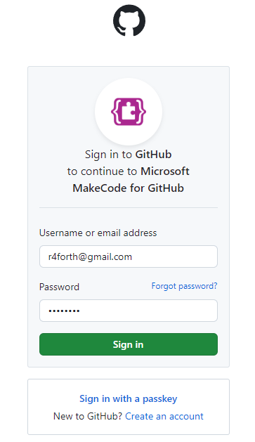

  授權 Microsoft Make Code 程式來操作 Github Repos

	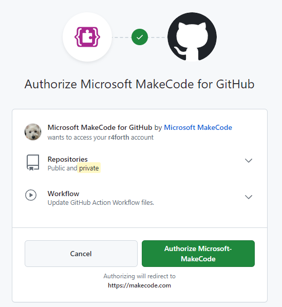

	- 建立 GitHub 儲存庫。 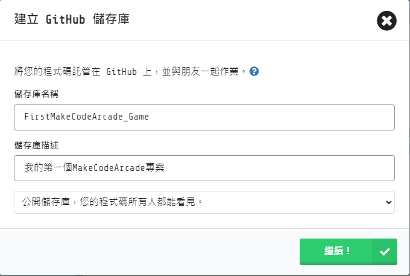
		- 儲存庫名稱最好用全英文數字，例如「FirstMakeCodeArcade_Game」。
		- 儲存庫描述可以使用中文，例如「我的第一個MakeCodeArcade專案」。
		- 設定公開儲存庫，才不需要另外付費。
	- 檢視 Github 上建立的專案
		- 登入到 Github 網站，檢視 MakeCode Arcade 系統自動上傳到 Github 的專案。 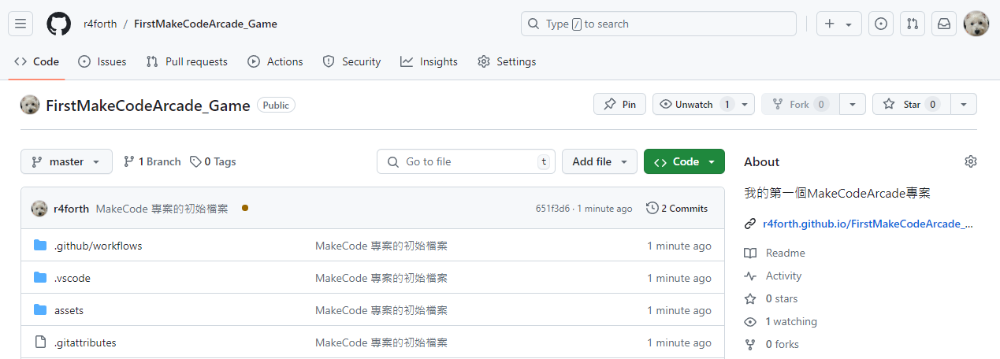
		- 您會發覺系統同步與建立不少檔案，要注意的事情是，這裡大部份都系統透過模板自動建立的。
	- Github 佈署的幾個好處
		- 您可以用比較簡單的方式來檢視過去歷史提交的內容。
		- 對您的程式碼進行快照並建立發行版本。
		- 將更新好的程式碼提交到 Github 後，並檢視修改後的效果。
	
## 程式碼

* 積木程式碼 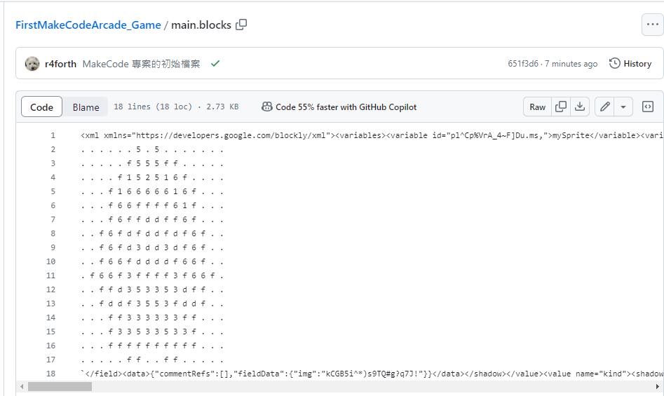

* Python 程式碼 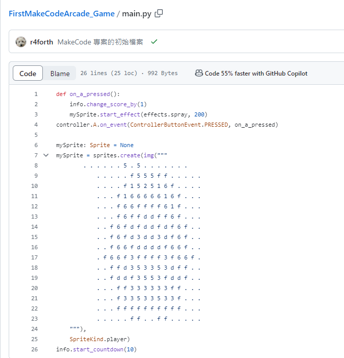

* avaScript 程式碼 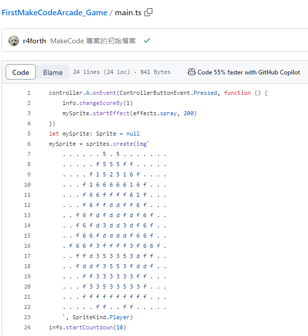

## 參考資料

* [關於使用 MakeCode Arcade 與 GitHub Classroom](https://docs.github.com/zh/education/manage-coursework-with-github-classroom/integrate-github-classroom-with-an-ide/about-using-makecode-arcade-with-github-classroom)
