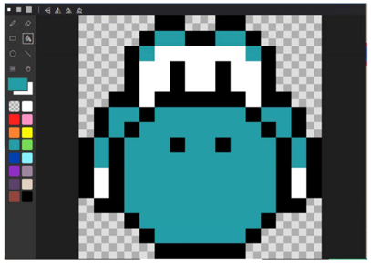

# 05.像素藝術，設計遊戲圖案

## 前言

早期的遊戲因為當年硬體效能與執行的環境，畫面解析度並不高，使用一種叫做像素圖(Pixels Art)的方式來顯示圖像。

維基百科是這樣解釋的:

```
像素畫是一種以「像素」（Pixel）為基本單位來製作的電腦繪圖表現形式[1]。

在電腦繪圖的兩大類別——點陣圖與向量圖——當中，像素畫以點陣圖（bitmap）的形式，從電腦最原始的圖像表現方法，演變成了一種獨立的數位藝術創作風格。此風格通常被人稱為「像素藝術」（pixel art），有時也被稱為「點繪」（dot art）、「點圖」、「點畫」、「像素圖」、「dot繪」等。
```

像素畫最早出現在八位元的遊戲機的圖樣與電腦應用程式的圖示(Icopn)。底下是一些很經典的圖案:

1. 蘋果電腦創辦人的臉 
   
2. 麥金塔作業系統經典圖示
   
3. 建構英文字型
   
4. 可以利用 Excel 的儲存格來產生中文字型
   
5. 建立 15x15 的中文字型
    

## 設備需求清單

1. 您需要一台可聯網桌機或是筆記型電腦，Windows、MacOS、Linux 系統均可。
2. 幾張方格紙
3. 16 色彩色鉛筆一組
4. (選擇性) 16色拚豆、拚豆版與小夾子

## 像素藝術與設計遊戲圖案

### 繪製像素畫的方法

1. 規劃你的角色大小。
   
   WiFiBoy Arcade 機器的螢幕解析度是 160x128 個像素點。圖形越大描繪起來就越辛苦，但圖案會越精細。建議先從 16x16 大小的圖案開始設計。您可以在網路上用「pixal arts 16x16 icons」搜尋。

2. 從基本形狀開始描繪。

   您可以試著用 MakeCode Arcade 內建的角色編輯器的內建工具來畫圖案。

3. 認識 [MakeCode Arcade 的調色盤](https://arcade.makecode.com/developer/images)
   - **#000000**  MakeCode Arcade 保留一個位置作為透明色
   - **#FFFFFF**  White         白色
   - **#FF2121**  Bright Red    亮红色
   - **#FF93C4**  Pink          粉红色
   - **#FF8135**  Vivid Orange  鲜橙色
   - **#FFF609**  Bright Yellow 亮黄色
   - **#249CA3**  Teal          青色
   - **#78DC52**  Bright Green  亮绿色
   - **#003FAD**  Royal Blue    寶藍色
   - **#87F2FF**  Light Cyan    淺青色
   - **#A4839F**  Dusty Lavender淺紫灰色
   - **#5C406C**  Deep Violet   深紫色
   - **#E5CDC4**  Pale Pink     淺粉色
   - **#91463D**  Rust          鐵鏽色
   - **#000000**  Black   黑色
4. 使用對稱性來減少像素畫的製作時間
5. 進階使用者會利用 **dithering 抖動** 的技法來表現物體的陰影與光線軌跡。

### MakeCode Arcade 拼豆學習單

在 MakeCode Arcade 官網上有一份拼豆學習單很適合大家搭配像素畫繪製一起學習。

https://arcade.makecode.com/arts-and-crafts/perler-bead-sprites


### 認識角色(Sprites) 類別

在遊戲中角色(Sprites，也有人翻譯成精靈)是一個可以移動與變化的二維圖片。在 MakeCode Arcade 中，每個角色有許多相關聯的屬性:

* 位置
* 大小
* 方向
* 加速度
* 速度
* 壽命

我們可以利用這個  [**角色數據外掛**](https://arcade.makecode.com/pkg/microsoft/arcade-sprite-data) 來設定角色的屬性


角色圖案可以被定義為

1. 主角(Characters)
2. 敵人(Enemies)
3. 子彈(Projectiles)
4. 食物(Food)
5. (Triggers)
6. 裝飾品(Decorations)
   
等物件，您可以透過程式功能來控制。

建立一個主角並設定它的種類。我們選擇戰士作為我們的主角，並設定他為玩家(Player)。


## 程式碼

我們用使用瑪莉兄弟遊戲裡面的耀西圖案來介紹如何使用 **角色編輯器** 來製作像素圖案。

開啟 **角色編輯器**


1. 第一區是設定像素圖大小，我們先設定為 16x16 點像素。
2. 第二區是 MakeCode Arcade 是開發環境可以使用的調色盤。
3. 第三區是類似小畫家的繪圖工具區。
4. 第四區是畫圖區域。

先參考漫畫圖形，把耀西的外框畫出來。


按照圖案的顏色著色。



如果您要選取圖案，可以使用圖形選擇工具。


使用 **角色編輯器** 來畫像素圖是不是很簡單呢?


## 參考資料

1. [像素畫](https://zh.wikipedia.org/zh-tw/%E5%83%8F%E7%B4%A0%E7%94%BB)
2. [文鼎字型點陣字原理](https://www.facebook.com/arphicfont/photos/a.130197850478319/1556005514564205/?type=3)
3. [MakeCode Art and Images](https://arcade.makecode.com/developer/images)