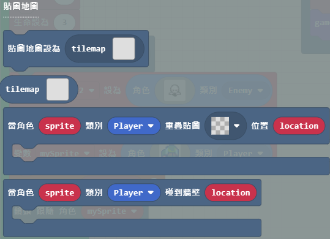

# 06. 在 MakeCode Arcade 中設置場景

## 遊戲中不可或缺的場景要素

學會了製作角色圖案，接著就要來了解遊戲的另外一個重要元素 **場景(Scene)**。

在 MakeCode Arcade 的開發環境中，場景（Scene）指的是遊戲中的不同狀態或畫面。場景可以是遊戲的開始畫面、遊戲進行中的主畫面、過關畫面，或是結束畫面等。場景功能主要包括設置背景顏色、設定相機跟隨角色、管理地圖磁磚，以及處理角色與場景中的物件或地形的互動等。

簡單來說，場景就是遊戲的各個畫面，你可以在不同的場景中設定不同的遊戲內容和規則。例如，在一個場景中玩家可能需要打敗敵人，而在另一個場景中則可能需要解謎或尋找物品。場景之間的切換是根據遊戲的進度或玩家的操作來決定的。

## 場景積木內建功能

**請注意!**

不要試著把所有的功能記下，這樣是沒有意義的。只要知道大致功能是放在場景積木的哪個區塊即可。軟體功能也可能隨著 MakeCode Arcade 改版而有所異動位置或增減功能。試著做點實驗，寫個小遊戲來測試功能，反而會比直接閱讀文件更有用。

* 畫面(Screen) 

* 鏡頭(Camera)

* 效果(Effects)

* 貼圖地圖(Tilemap)

* 操作貼圖地圖(Tilemap Operations)

* 地圖位置(Locations)

## 細部解說

在我們進一步討論之前，讓我們先談談什麼是貼圖地圖(Tilemap)。Tile，也就是磁磚。目前 MakeCode Arcade 繁體中文版的翻譯是貼圖。貼圖地圖是角色的背景區域，由稱為「磁磚」的正方形組成，每個磁磚寬 16 像素，高 16 像素。通常整個貼圖地圖比螢幕（160x120像素）大，給人一種角色有更大世界可供探索的感覺。

默認貼圖地圖為 16 格寬 x 16 格高，但您可以將尺寸更改為每個方向最多 255 格！

貼圖圖編輯器與圖像編輯器略有不同，因為您可以使用完整的 16x16 圖塊進行繪製。因此，您可以用一塊草地磁磚逐個填充地圖，而不是用綠色之類的顏色看逐一地填滿地圖。

當然，你可以通過使用畫廊中的額外瓷磚來使你的貼圖地圖更加複雜或者通過建立您自己的圖塊來添加素材。

一旦你創建了你的貼圖地圖並將其添加到你的專案中，你就可以編寫讓角色與場景互動的程式碼。

請參考底下的程式碼，試著找出所有的積木，並使用積木程式拼出同樣的功能。您也可以自行修改，有的時候，透過實驗測試，努力實現自己的想法，也會讓您程式功力大增喔!

## 程式碼

您可以試著連線到這個案例

* [**https://makecode.com/_5ae3M1JdH0Re**](https://makecode.com/_5ae3M1JdH0Re)

## 參考資料

1. [MakeCode Arcade 場景功能使用手冊](https://arcade.makecode.com/reference/scene)