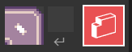

# 07. 在 MakeCode Arcade 中使用貼圖地圖

## 前言

上一篇文章我們有稍微介紹到貼圖地圖的功能，但並沒有仔細地介紹。今天我們將針對如何使用貼圖地圖(Tile Maps)這個特殊功能，進行詳細解說。

初學者如果能正確區分使用場景與貼圖地圖的時機，就會讓遊戲的素材更豐富，玩起來更加有趣。

## 什麼是貼圖地圖(Tile Maps)?

貼圖地圖(Tile Maps)是一組小塊、方形且具有重複性圖片所組合而成的遊戲場景。

如果您有玩過大戰略類型的遊戲，您就會更知道我在說什麼。請參考任天堂 GBA 上這個知名遊戲 [**高級戰爭Advanced War**](https://zh.wikipedia.org/zh-tw/%E9%AB%98%E7%BA%A7%E6%88%98%E4%BA%89)

 的遊戲素材圖。資料是從 [www.spriters-resource.com](https://www.spriters-resource.com/game_boy_advance/advancewars2blackholerising/) 找來。

這是用於製造貼圖地圖用的基礎素材，有

1. 道路(Road)
2. 管道(Pipe)
3. 環境素材類:
    - 草地
    - 山地
    - 森林
    - 火山
    - 河流、海洋、沙灘

貼圖地圖跟背景圖很類似，你也可以拿它做為遊戲場景，但還是有些許的不同。

* 背景一般來說部會隨著角色(Sprites)移動。
* 角色無法直接與背景作互動(雙方無法透過物件屬性進行事件處理)。
* 貼圖地圖通常是在背景圖的上一層。

我們可以開啟 **貼圖地圖編輯器**，你可以在場景中增加「牆」這個屬性，用來阻止角色在特定空間中移動。舉例來說:

* 建立一個地下城的地圖，限制玩家在特定區域中活動。
* 建立一個不會讓主角掉下來的平台。
* 建立一個賽車賽道，讓車輛在指定的範圍中移動。

要注意的是建築物素材不算是貼圖地圖的一部份，因為在此遊戲中，各種建築物會隨著天氣、陣營隸屬狀態而有所改變。

## 使用貼圖地圖編輯器

開啟貼圖地圖編輯器的步驟如下:

1. 點擊積木中間的 **tilemap** 圖案

請先用螢幕左邊中間的 **Gallery** 標籤裡面的素材，

編輯出類似底下的貼圖地圖。

貼圖地圖編輯器與角色編輯器的畫面很類似，編輯完貼圖地圖後，請開啟螢幕左邊中間的「我的圖塊」標籤，選擇你自己建立的貼圖然後來完成整張地圖。

你可以在整張貼圖地圖中設定牆壁。啟動功能在右上角有個 **Show walls** 選擇鈕。

牆壁可以位在整張地圖的任意地方，一切由你自己決定。牆壁使用半透明的紅色來表示。此時您將指定地圖的特定位置，將其標記成半透明紅色，來代表這位置是牆。

切換標記牆功能的畫面

## 特別說明貼圖地圖區

* 預設的貼圖地圖放在 **Gallery** 之下，裡面有:

* 自己建立的貼圖地圖放在 **My Tiles** 底下。

* 你可以用下拉選單來選擇哪一組貼圖地圖。
* 透過底部的左右選項按鈕來切換這一組貼圖的項目

### 瓷磚牆壁選擇功能

* 當你選擇左邊瓷磚時(白框在左邊圖案上)，即可放置瓷磚。

* 當你選擇右邊牆壁時(白框在右邊圖案上)，即可放置牆壁。

### 常用工具

* 鉛筆      在任意位置畫點(即放置一塊瓷磚)  
* 橡皮擦    在任意位置點選，清除一塊瓷磚。
* 矩形      以像素(瓷磚)單位，建立一個矩形。
* 油漆桶    已指定的瓷磚替換整個區域的圖像
* 圓圈      以指定瓷磚作為外框，建立一個圓形
* 直線      以指定瓷磚作為點，建立一條直線
* 區塊選擇  選擇瓷磚地圖的區域(可支援複製、移動或刪除)
* 手        平移整個工作區域

### 放大鏡

右下角區域有放大縮小功能，可以檢視整張地圖。

放大檢視整張瓷磚地圖。

### 特殊工具 

* 設定像素大小(1x1、2x2 或 3x3)
* 翻轉或是旋轉圖像

## 程式碼

程式碼與昨天的內容相同，只是自己修改了部份貼圖地圖的素材。

## 參考資料

1. [Gba 大戰](https://www.nintendo.com/us/store/products/advance-wars-1-plus-2-re-boot-camp-switch/)
2. [Gba 大戰素材](https://www.spriters-resource.com/fullview/119795/)