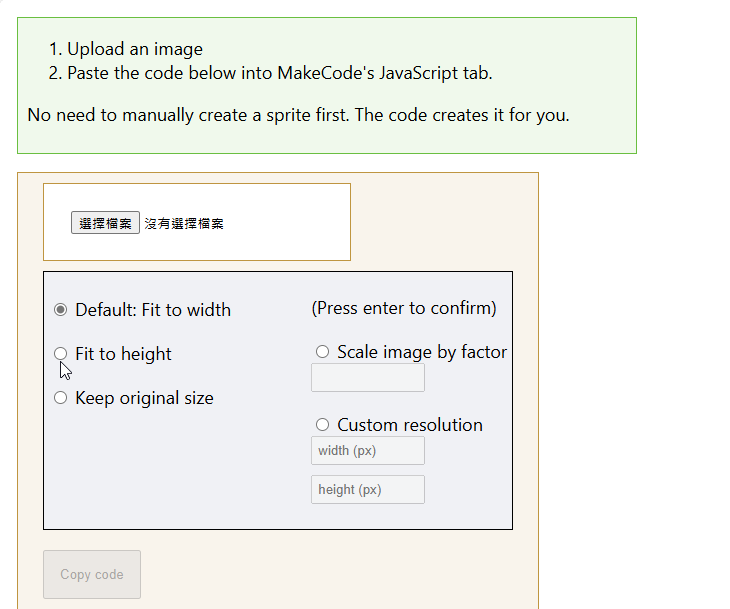
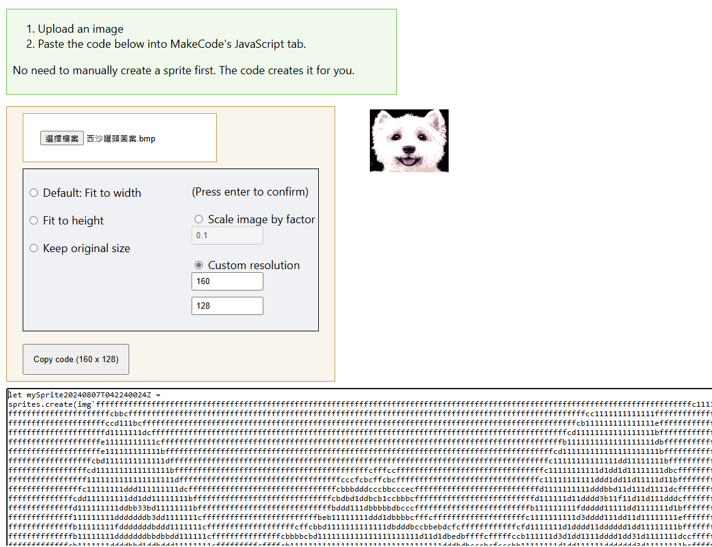
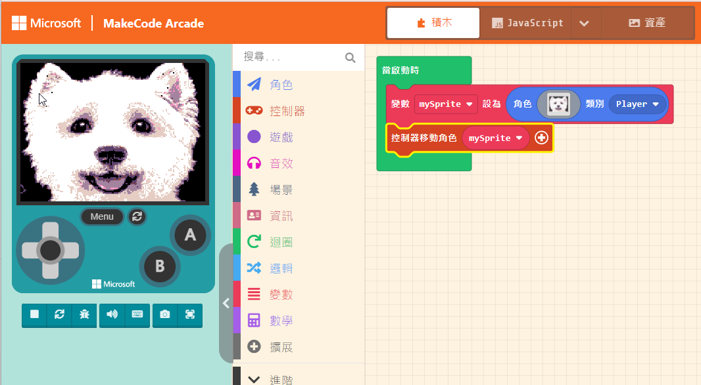
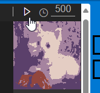

# 08. 為 MakeCode Arcade 建立圖案素材包

## 前言

我們都不是專業的像素圖畫家，如果要一點一點來畫素材，那可是一件非常辛苦的苦功。本日，我們來介紹幾個實用的工具網站，讓您輕鬆地將圖片轉成 MakeCode Arcade 環境可以接受的資料格式。

1. 圖片轉 MakeCode Arcade JavaScript 語法

* [https://kristianpedersen.github.io/Convert-Image-to-MakeCode-Arcade-Sprite/](https://kristianpedersen.github.io/Convert-Image-to-MakeCode-Arcade-Sprite/)

2. 線上版 MakeCode Arcade 資源編輯器

* [https://shakao.github.io/arcade-sprite-pack/](https://shakao.github.io/arcade-sprite-pack/)   

3. gif 動畫編輯工具

* [https://ezgif.com/maker](https://ezgif.com/maker)

## 設備需求清單

1. WiFiBoy Arcade D51 一台
2. 一台可上網的筆電或桌機
3. [範例程式檔](img/08/ArcadeDemoAssets.zip)

## 如何轉換圖片

1. 先解壓縮 **範例程式檔**，檔案解壓縮後的內容大致是:

2. 建立新 MakeCode Arcade 專案

3. 開啟 [線上圖片轉 MakeCode Arcade JavaScript 語法工具] (https://kristianpedersen.github.io/Convert-Image-to-MakeCode-Arcade-Sprite/)

4. 指定要轉檔的圖案，例如 **西沙罐頭圖案.bmp**，然後指定解析度(Custom resolution)，設定為 160x128。

5. 點選 **Copy code**，複製程式碼，利用文書處理工具來替換特定字串。例如更換 **f** 變成 **0**，就是把黑色背景改成透明色，即是去背景色。

但這種方法比較暴力，會直接將狗眼睛與狗鼻子的顏色直接換成透明色，變成這樣:

6. 此時您可以用繪圖工具的油漆桶，點選黑色，將狗眼睛與狗鼻子塗成黑色。

7. 您可以使用這樣的方法，利用附件檔裡面的其他圖片，進行轉檔，變成自己的資源。完成結果如下:

## 操作線上版 MakeCode Arcade 資源編輯器

1. 開啟線上編輯器，依照上面的方法分別匯入四張圖片。

2. 點選右上角有匯出選項，會出現底下的畫面:
   

* `Export .mkcd file`   將整個專案匯出。這功能最方便，會打包所有的資源檔，保留好，未來整個匯入到新專案即可。也能直接分享給其他人。
* `Export PNGs` 將圖片檔匯出成個別的 PNG 檔。
* `Export animations as GIF` 將動畫匯出成動態 GIF 檔。

3. 保留相關檔案，未來有新專案就可以隨時匯入使用。

## 線上動畫 GIF 檔案編輯器

1. 開啟 https://ezgif.com/maker ，匯入您要處理的動畫檔。

使用上面的工具對於動畫進行處理，並選擇要輸出的單張圖片

2. 由於 **線上版 MakeCode Arcade 資源編輯器** 的動畫功能無法直接匯入 動畫gif 直接轉檔，因此要一張一張的將圖片加入轉成動畫。(MakeCode Arcade 裡面的動畫工具也是)。

 

 3. 我們將目錄裡的幾個單格 gif 檔轉成圖片後，加入到動畫編輯器裡，這樣您就可以得到第一個動畫資源檔。

 

製作像素圖與像素動畫是一件相當辛苦的工作，雖然目前網路上找到的工具還不是很便利，但也幫助我們省下不時間。我們終於可以建立屬於自己的素材庫了。

## 參考資料

1. [圖片轉檔工具](https://kristianpedersen.github.io/Convert-Image-to-MakeCode-Arcade-Sprite/)
2. [線上版 MakeCode Arcade 資源編輯器](https://shakao.github.io/arcade-sprite-pack/)
3. [線上動態 gif 處理工具](https://ezgif.com/maker)