# 09. 學習控制按鈕角色

學會繪製與匯入遊戲素材後，就是我們開始控制每個角色如何動作。本日，我們將會介紹 MakeCode 中兩個主要的積木類別:

1. 角色(Sprites)
2. 控制器(Controler)

## 介紹角色積木

通常我們會在遊戲中設定主角、敵人與各種物品。變數是要幫主角取名(名字不能重複，這樣系統才知道你要操作哪個主角)。取完名後，就要幫主教設定他是哪個類別。你是主人，你可以當主角，別的玩家，你就可以把他定義成敵人。

我們會在角色中間的白框框中，透過圖像編輯器，設定主角的圖案。

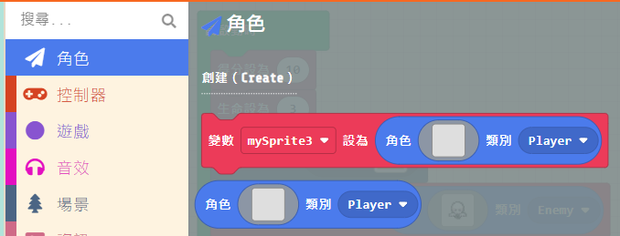

每個主角都可以設定他的物理狀態，例如設定:

1. 出現在螢幕的位置
2. 他的速度
3. 角色跟隨哪個角色 
等特性

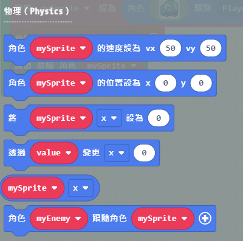

然後幫主角設定一些效果，像是一出場就會自帶 BGM 或是灑花的效果。

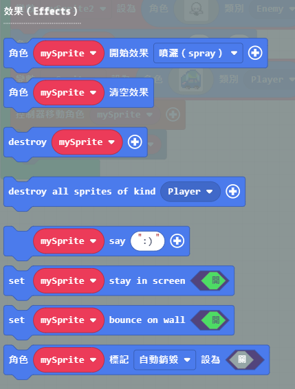

發射物(Projectiles)，我們可以理解成為遊戲中的子彈或是氣功。可以到處發射，可以設定子彈的速度與是誰發射的。

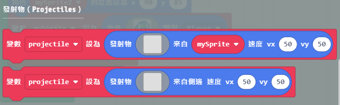

重疊判斷很常用。通常我們在 RPG 遊戲中，會設定主角兩個人碰在一起就會進行對話模式。

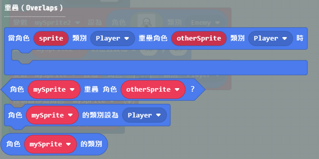

生命週期則是設定某個角色在遊戲中的存活時間。你可以想像 NPC 這類的角色，最適合搭配這個功能。

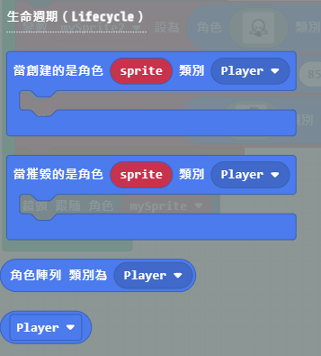

圖像則是最基礎、最常用的一個積木。設定角色後，就可以進圖像編輯器畫主角或是指定主角的圖案。

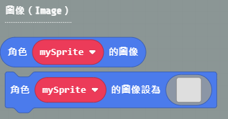

Scale 功能則是可以設定圖像的大小與出現在畫面的哪個區域。

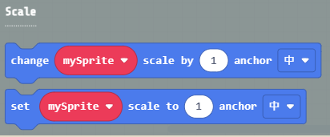

## 介紹控制器積木

MakeCode Arcade 目前的版本支援單人與多人遊戲。多人遊戲最多支援四人對戰。

單人控制積木

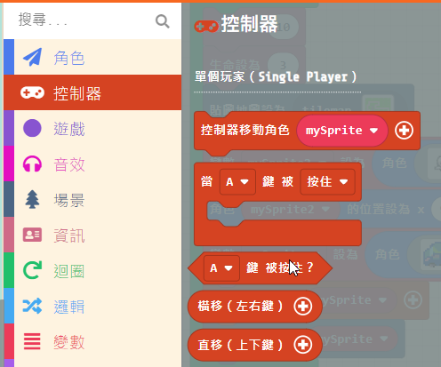

多人控制積木

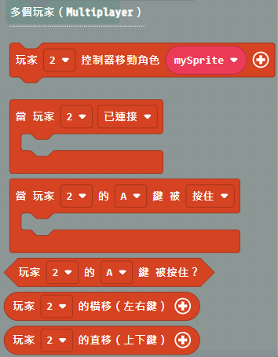

手把控制對應的鍵盤按鈕

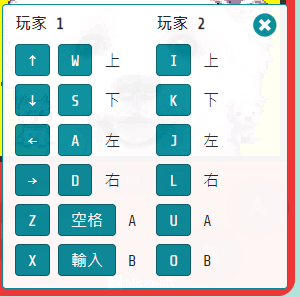

多人遊戲用不同的顏色面板做區分，分別有紅藍橘綠

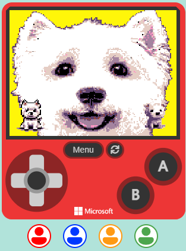

## 程式碼

參考我的程式碼，自己練習喔!

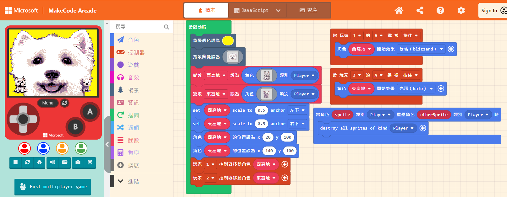

## 參考資料