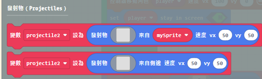
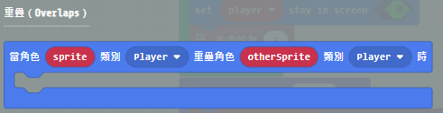
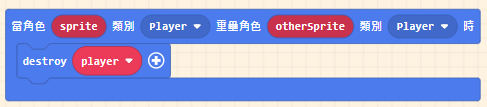
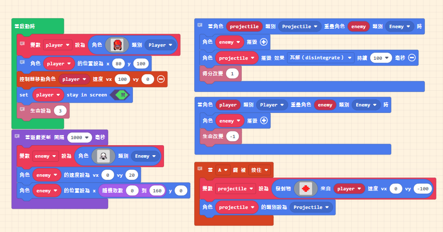
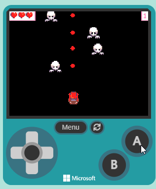

# 10. 了解子彈發射事件

## 射擊類遊戲

Arcade 街機遊戲中的 STG（Shooting Games，射擊遊戲）類遊戲，是街機遊戲中的一個重要分類。這些遊戲通常以玩家操控一個角色或載具，擊敗不斷出現的敵人為主要玩法。STG 類遊戲可以進一步分為幾個子類型：

* 縱向捲軸射擊遊戲（Vertical Scrolling Shooters）：

特色：玩家的角色或載具通常位於畫面的底部，敵人從畫面上方出現並向下移動。
經典作品：如《1942》、《雷電》（Raiden）、《怒首領蜂》（DoDonPachi）。

* 橫向捲軸射擊遊戲（Horizontal Scrolling Shooters）：

特色：玩家的角色或載具通常位於畫面的左側，敵人從畫面右側出現並向左移動。
經典作品：如《R-Type》、《魂斗羅》（Contra）、《グラディウス》（Gradius）。

* 固定畫面射擊遊戲（Fixed Shooters）：

特色：玩家的角色或載具固定在畫面底部或中間，敵人從四面八方出現，玩家需要靈活躲避和攻擊。
經典作品：如《太空侵略者》（Space Invaders）、《銀河戰士》（Galaga）。

* 彈幕射擊遊戲（Bullet Hell/Danmaku）：

特色：這類遊戲以畫面上出現大量敵人子彈為特徵，玩家需要在密集的彈幕中尋找空隙進行躲避。
經典作品：如《怒首領蜂 大往生》（DoDonPachi DaiOuJou）。

* 光槍射擊遊戲（Light Gun Shooters）：

特色：這類遊戲通常使用光槍作為控制器，玩家需要用光槍瞄準並射擊屏幕上的敵人。
經典作品：如《時空偵探》（Time Crisis）、《死亡之屋》（The House of the Dead）。

STG 類遊戲以其快速的遊戲節奏、精確的操作需求和豐富的視覺效果吸引了大量玩家。在這些遊戲中，玩家不僅需要有敏捷的反應能力，還需要掌握敵人的攻擊模式和最佳的攻擊策略，以獲得高分和通關。

## MakeCode Arcade 中常用的子彈功能積木

上面顯示的彈丸創建塊在我們的教程和技能圖中被大量使用。對於應該從螢幕外進來的物品來說，這真是太棒了，因為每個彈丸都會在它前進的方向的相反邊緣生成。

這第二個彈丸創建塊非常適合從玩家或敵人那裡「射擊」或「投擲」物品。該塊將在您定義的精靈中心生成彈丸，該精靈的運動由您指定的 vx 和 vy 指導。

請記住，任何一個方塊都只會生成一個彈丸。要創建多個，您需要將塊置於迴圈或重複事件中。

在任一情況下設置的速度將決定彈丸飛行的方向：

彈丸碰撞

一旦你把它們與重疊事件配對，彈丸就會真正變得有用。這些使您可以在角色和彈丸碰撞時獲得積分或失去生命。您還可以使用重疊事件在彈丸與瓦片圖元素碰撞時破壞或更改瓦片。

要記住的一件重要事情是，您必須立即摧毀與物品重疊的確切彈丸，否則您的重疊事件將連續觸發幾次。

為了確保你正在摧毀與你的物品重疊的確切彈丸（特別困難，因為你的所有彈丸都有相同的名稱），你需要使用重疊事件標題中提供的變數值......這樣：

## 程式碼

遊戲執行畫面

## 參考資料

1. [1942(Video Game)](https://en.wikipedia.org/wiki/1942_(video_game))
2. [雷電](https://en.wikipedia.org/wiki/Raiden_(video_game))
3. [怒首領蜂 DoDonPachi](https://en.wikipedia.org/wiki/DoDonPachi)
4. [R-Type](https://en.wikipedia.org/wiki/R-Type)
5. [死亡鬼屋](https://zh.wikipedia.org/zh-tw/%E6%AD%BB%E4%BA%A1%E9%AC%BC%E5%B1%8B)