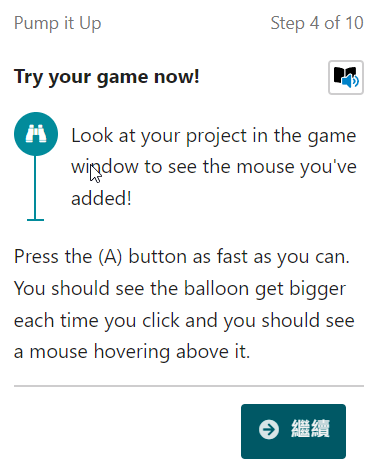
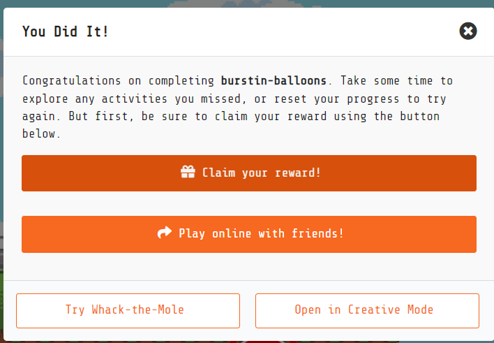

# 12. 從官網的技能樹課程來學習完整遊戲設計 

懂得積木的大致分類後，就要進入到遊戲設計學習。最好的學習方式就是跟著官網的技能樹課程來學。透過完成一個一個遊戲，你可以從中體會出完整遊戲需要準備的要素有哪些?不過要注意的事情是，技能樹課程大部份的關卡都很長，小朋友需要極大的耐心，建議老師或家長，可以陪著他們一同學習，在旁邊適當地解說。

我們用裡面最短的課程，來教大家如何做一個類似馬力歐耀西島的氣球爆炸遊戲:

## 氣球爆炸遊戲

從官網的 **Beginner Skillmaps 初學者技能樹** 中找到 **Burstin' Balloons** 

### 第一關

第一個關卡是希望妳「製作一個簡單的嘉年華遊戲，快速點擊來嘗試在時間內戳破氣球」。clicker game 的意思是點擊遊戲。

[遊戲簡介](https://youtu.be/jZGvmt6X880)

從 **控制器** 積木區找出 **當 A 鍵被按住** 積木，並拖到空白的工作區域。

從 **資訊** 積木區找出 **玩家1的得分改變1** 積木，並拖到 **當 A 鍵被按住** 裡面。

這個時候你可以按下你鍵盤上的空白鍵，看是不是遊戲模擬器上的分數，會隨著一次次按下空白鍵，分數一直往上加?

從 **嘉年華 Carnival ** 積木區找出 **start countdown [20] (s) and game over [lose game]** 積木，放到 **當啟動時** 積木裡。

從 **場景** 積木區找出 **背景顏色設為** 積木，並拖到 **當啟動時** 積木的最後。

這樣就完成了最簡單的點擊遊戲。

遊戲程式碼:

遊戲執行畫面

第一關結束

### 第二關

新增一個氣球，隨著你的點擊而膨脹！你會驚訝於它在時間結束前膨脹得多大。雙擊第一關開始遊戲。

目前只是先叫出之前已經開發好的程式，確定上一關的功能你有完成。

註! 這是技能樹課程的特色，如果你只是一直點選下一步，而沒有真正理解裡面說明步驟來寫程式，你的程式到最後關卡依然會是無法運作。請老師與家長指導小朋友時，要特別說明。

從 **角色** 積木區找出 **變數 myBalloon 設為角色 [] 類別 player** 積木，並拖到 **當啟動時** 的最後。

另外點選角色中空白的圖像區域，開啟圖像編輯器，點選 **我的資源** 選擇紅色氣球。

從 **角色** 積木區找出 **腳色 myBalloon 的位置設為 x 80 y 93** 積木，並將其放到 **當啟動時** 的最後。 

從 **Scaling** 積木區找出 **change myBalloon scale by 1 pixels uniformly ancher 下** 積木，拖到 **當A鍵被按住** 積木的最後。

現在試試看玩玩這個遊戲，你會看到氣球慢慢變大。

從 **角色** 積木區找出 **變數 myBooth 設為角色類別 Booth** 積木，拖到 **當啟動時** 積木的最後。

**Booth** 可以翻譯成「攤位」或「展位」，具體意思會根據上下文而定。它通常指在展覽會、嘉年華會或其他活動中設置的小型區域，用來展示商品、進行遊戲或提供服務。

從 **角色** 積木區找出 **當角色 sprite 類別 Player 重疊角色 otherSprite 類別 Booth 時** 積木，拖到工作區空白處。

從 **Carnival** 積木區找出 **game over nultiplater** 積木，拖到當角色 sprite 類別積木裡面。

試玩你的遊戲

從 **Carnival** 積木區找出 **game over nultiplater** 積木，拖到當角色 sprite 類別積木裡面。

第二關程式碼

第二關結束

### 第三關

遊戲畫面

點選遊戲模擬器，試著按下 A 或空白鍵，你會發現氣球會變得越來越大，超過線後就會贏得本場遊戲。

在角色圖案中，從我的資源中選取 **mouse1-up** 圖案。

設定

第三關結束

### 第四關

### 獎勵與認證

### 完整程式碼

## 參考資料

1. [耀西島氣球爆破遊戲](https://www.mariowiki.com/Balloon_%28Mini_Battle%29)