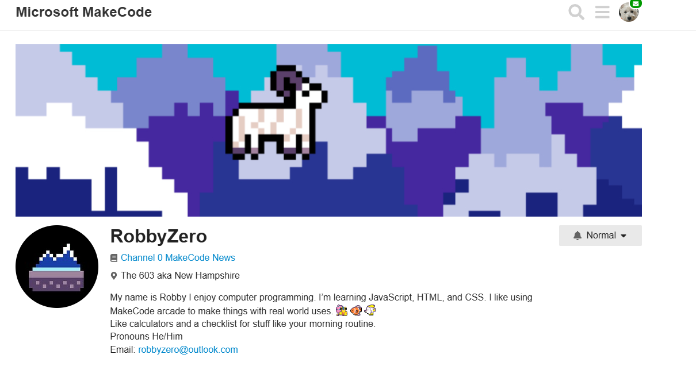
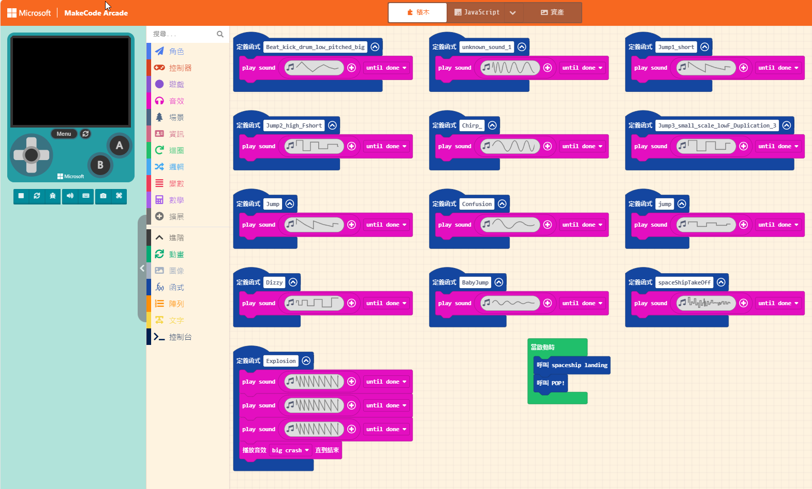

# 15. 看看高手的音樂製作範例

## 基礎音樂音效範例

MakeCode Arcade 論壇的 [RobbyZero](https://forum.makecode.com/u/RobbyZero/summary) 用戶做了一個很多音效的基礎範例。各位讀者可以試著看看他的程式碼。




* [Sound effects Gallery](https://arcade.makecode.com/S34462-97758-42701-82980)



## 音樂遊戲 

不知道各位讀者有沒有聽過一個叫做 synthesia 的鋼琴遊戲?


也有手機版的遊戲


《Synthesia》是一款讓玩家以遊戲方式學習鋼琴的音樂軟體。玩家通過螢幕上方下落的音符來彈奏對應的鋼琴鍵，類似於節奏遊戲，但更專注於真實的鋼琴演奏。它支援MIDI文件，讓玩家能自由選擇曲目來練習。除了遊戲模式，還有專門的練習模式，玩家可以按照自己的節奏學習，並分開練習左右手。這款軟體適用於Windows、macOS、iOS和Android等多個平台，並支援連接MIDI鍵盤。無論是初學者還是有經驗的鋼琴愛好者，都能透過《Synthesia》在學習與娛樂中找到樂趣。

## MakeCode Arcade 的仿製版範例

MakeCode Arcade 論壇的 [UnsignedArduino](https://forum.makecode.com/u/UnsignedArduino/summary) 用戶開發了一個套件庫，可以快速地建立這樣的範例，不過程式相當複雜，有興趣的讀者可以參考。

* [Arcade-MIDI-to-Song 擴充套件網址](https://github.com/UnsignedArduino/Arcade-MIDI-to-Song)

您可以看看他的 [阿拉丁音樂範例](https://arcade.makecode.com/29943-67280-78285-76595)

執行畫面


另外論壇上還有一位 [Brohann](https://forum.makecode.com/u/Brohann/summary)，做了 **超級瑪利歐音樂** 的範例音樂。您可以點選這個[網址](https://arcade.makecode.com/S79351-61496-14893-03043)來欣賞。


## 什麼?有人做成卡啦OK?

論壇上有一位神人貼出了卡啦 OK 範例程式，有興趣的讀者也可以讀這篇貼文。

* [卡拉OK](https://forum.makecode.com/t/karaoke/22038/1)


鍵盤控制按鈕:


```
 A: Pause/resume
            B: Restart
            ↕: Adjust BPM/Tempo
            → jump to next sentence
            ← jump to beginning of current sentence
            ←← previous sentence

            when pausing:
            ↕ Pitch(raise/fall) tune
            ↔ Wider/narrower width of notes
```

* [程式範例](https://arcade.makecode.com/S18408-32820-19042-88868) 

## 程式碼

試著寫一個陽春版的音樂 ICON 掉落的小程式，用生日快樂歌當代表

積木程式我不會寫，用 JavaScript 轉積木程式


JavaScript 程式碼(僅供參考)

```
let notes = [262, 262, 294, 262, 349, 330, 262, 262, 294, 262, 392, 349, 262, 262, 523, 440, 349, 330, 294, 466, 466, 440, 349, 392, 349]
let noteTexts = ["C", "C", "D", "C", "F", "E", "C", "C", "D", "C", "G", "F", "C", "C", "C5", "A", "F", "E", "D", "A#", "A#", "A", "F", "G", "F"]

let currentNoteIndex = 0
let noteWidth = 16 // 音符圖案的寬度
let lineHeight = 16 // 每一行的高度
let startX = 0 // X 位置初始化
let startY = 0 // Y 位置初始化

// 初始設定
scene.setBackgroundColor(15)

game.onUpdateInterval(500, function () {
    // 计算目前音符的X位置
    let noteX = startX + (currentNoteIndex * noteWidth)

    // 如果音符的X位置超出螢幕寬度，則換行
    if (noteX >= screen.width) {
        startX = 0 // 重設X位置
        startY += lineHeight // Y位置移到下一行
        currentNoteIndex = 0 // 重設目前音符索引值
        noteX = startX + (currentNoteIndex * noteWidth) // 计算換行後X的位置
    }

    // 如果超過螢幕高度，遊戲結束。
    if (startY >= screen.height) {
        game.over(true)
    } else {
        // 建立音符圖案
        let noteSprite = sprites.create(img`
            . . . . . . . . . . . . . . . . 
            . . . . . . . . . . . . . . . . 
            . . . . . . . . . . . . . . . . 
            . . . . . . . . . . . . . . . . 
            . . . . . . . . . . . . . . . . 
            . . . . . . . . . . . . . . . . 
            . . . . . . . . . . . . . . . . 
            . . . . . . . . . . . . . . . . 
            . . . . . . . . . . . . . . . . 
            . . . . . . . . . . . . . . . . 
            . . . . . . . . . . . . . . . . 
            . . . . . . . . . . . . . . . . 
            . . . . . . . . . . . . . . . . 
            . . . . . . . . . . . . . . . . 
            . . . . . . . . . . . . . . . . 
            . . . . . . . . . . . . . . . . 
            `, SpriteKind.Player)

        noteSprite.setPosition(noteX, startY)
        noteSprite.vy = 50

        // 顯示音符名稱
        noteSprite.say(noteTexts[currentNoteIndex], 500)

        // 播放聲音
        music.playTone(notes[(startY / lineHeight) * (screen.width / noteWidth) + currentNoteIndex], music.beat(BeatFraction.Half))

        // 更新目前音符索引
        currentNoteIndex += 1

        // 如果所有音樂撥放完畢，遊戲也結束
        if ((startY / lineHeight) * (screen.width / noteWidth) + currentNoteIndex >= notes.length) {
            game.over(true)
        }
    }
})

```

## 參考資料

1. [Synthesia](https://play.google.com/store/apps/details?id=com.synthesia.synthesia&hl=zh_TW)
2. [MakeCode Arcade 論壇](https://forum.makecode.com/)


