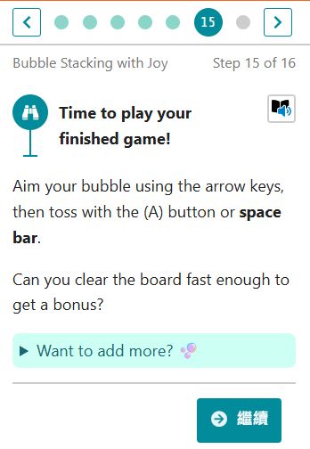

# 25. 創建一個泡泡爆破遊戲

你有沒有玩過這個經典的泡泡龍方怪遊戲?

微軟 MakeCode Arcade 平台三不五時會跟一些公司合作，像是迪士尼、漫威等公司。最近有個泡泡爆破的遊戲教學就很有意思，它可以讓您學會如何寫一個類似泡泡龍方塊的遊戲。

最近迪士尼與皮克斯推出的 「腦筋急轉彎 2(Inside Out 2)」電影上映，Arcade 小組利用裡面的角色做了一個類似的遊戲教程。

我們一起連到這個網址 [**https://aka.ms/bubbles**](https://aka.ms/bubbles)，一同學習吧。

課程簡介

先把遊戲背景做出來，來後開啟模擬器檢視

載入一排泡泡。

加入角色圖案

檢視目前遊戲畫面

將角色放到 102 位置

這樣角色出現的位置就比較合理

接著我們要來設定遊戲手把功能

設定遊戲手把的程式碼

設定泡泡發射後的動作

試著玩玩看遊戲

泡泡發射後，記得要再載入一個泡泡

可以開始玩你的遊戲

課程結束

分享專案

產生專案分享的連結

遊戲執行畫面

## 程式碼

## 補充說明

這個 Bubble 方塊是 Arcade 配合迪士尼影業製作的，並沒有開放給其他專案再利用，所以資產頁簽畫面上會看到一個一個鎖頭。

各位讀者有沒有發現除了腦筋急轉彎的角色外，其他素材都變色了。這個教程用了「變更調色盤」的技巧，讓遊戲的配色更符合腦筋急轉彎電影的設定。

## 參考資料

1. [泡泡龍方塊](Puzzle Bobble Arcade Cabinet MAME Gameplay w/ Hypermarquee)
